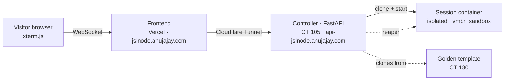

# ⚡ jaysync-lab-playground

> Real, disposable **Linux terminal sessions in the browser** — spun up on demand, destroyed the moment you disconnect. Live at **[jslnode.anujajay.com](https://jslnode.anujajay.com)**.

Not a simulation and not a shared shell — every visitor gets a **genuine, isolated Proxmox container**, cloned from a hardened golden template, on an air-gapped network segment, cleaned up automatically. No signup.

---

## 🏗️ Architecture

A visitor connects → the controller clones **CT 180** into a fresh session container on an isolated bridge → proxies the terminal back over a WebSocket → destroys it on disconnect. An independent reaper sweeps up anything that overstays.

## 🔗 How it fits

| Repo | What it is | Live |
|:-----|:-----------|:-----|
| [JaySync-Lab](https://github.com/JaySync-Lab/JaySync-Lab) | Infrastructure docs + inventory — the source of truth | — |
| [jaysync-lab-site](https://github.com/JaySync-Lab/jaysync-lab-site) | Next.js + Fumadocs docs site | [lab.anujajay.com](https://lab.anujajay.com) |
| **jaysync-lab-playground** *(here)* | This playground | [jslnode.anujajay.com](https://jslnode.anujajay.com) |

---

## 🧩 Repository layout

| Path | Purpose |
|:-----|:--------|
| `web/` | Next.js frontend (xterm.js terminal, offline handling) — deployed on Vercel |
| `controller/` | FastAPI session controller — runs as a systemd service on Proxmox CT 105 |
| `implementation-log.md` | Full phase-by-phase build & verification journal |
| `playground-*-plan.md` | Living implementation plans |

## 🧱 Tech stack

| Layer | Choice |
|:------|:-------|
| Frontend | Next.js 16 · React 19 · xterm.js · Vercel |
| Backend | FastAPI · Uvicorn · proxmoxer · websockets (Python) |
| Infra | Proxmox VE (LXC clone-per-session) · Cloudflare Tunnel · Upstash Redis |

## 🔒 Safety model

- **Disposable over resettable** — destroyed on disconnect, never reused
- **Isolated** — sessions sit on `vmbr_sandbox` with no route to the LAN or internet
- **Bounded** — resource caps, fork-bomb protection, **15 min** / **3 concurrent** / **1 per visitor**

---

## ✅ Status

**Phase 4 complete — live in production.** Network foundation, the golden template, the session controller, and the public web interface are all built, tested against the real host, and deployed. Full history in [`implementation-log.md`](implementation-log.md).

🔗 **Try it:** [jslnode.anujajay.com](https://jslnode.anujajay.com)
